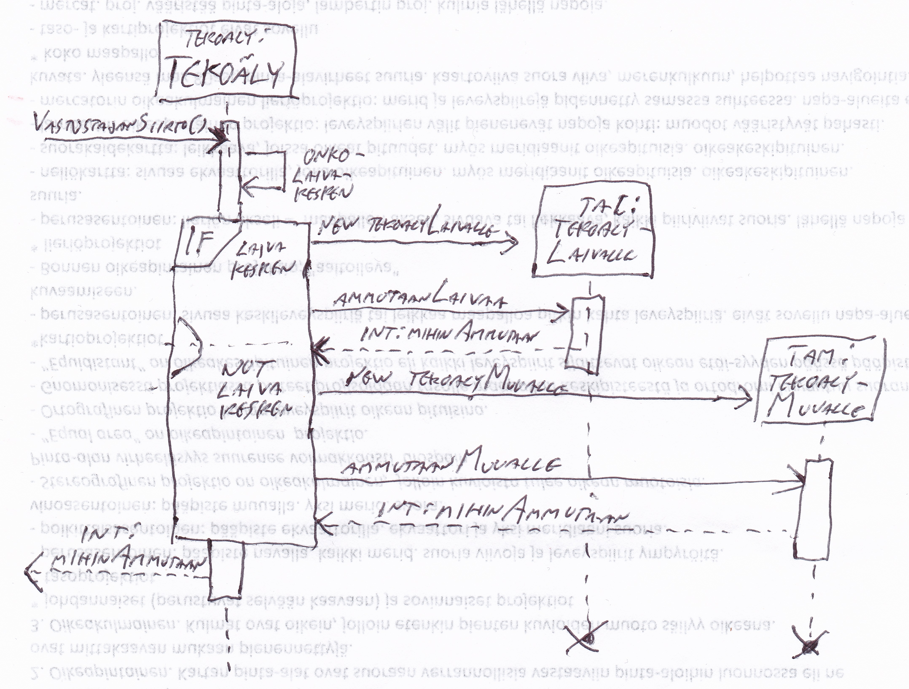

Aihe: Perinteisestä laivanupotuspelistä laajennettu versio. Pelissä jossa simuloidaan Itämeren ennustettuja tapahtumia vuonna 2020. Normaaliin upotuspeliin verrattuna pelialue on neljä kertaa suurempi, 20 x 20 palaa. Meren lisäksi kussakin maastossa on maapaloja järkeväksi saaristoksi aseteltuna. Saarilla on siviiliasumuksia, joihin ei saa osua. Jos osuu, vastustaja saa kerralla useamman pelivuoron. Peliin voi lisätä myös muita vastaavia erikoiskohteita.

Peliin tulee aloitusvalikko, jossa voi valita esimerkiksi pelattavan valtion tai sotilasliiton sekä pelin parametreja: Laivojen, talojen sekä maaston määrät sekä saariston "rikkonaisuuden" asteen. Pelin toteutuksessa esimerkiksi ääniefektejä ja grafiikkaa voidaan vaihdella pelattavan kohteen mukaan.

Käyttäjät: pelaaja vastaan tietokone. Mahdollisuus laajentaa muotoon pelaaja vastaan pelaaja, mutta pelin luonteen vuoksi tätä toteutusta ei kannata tehdä samalla tietokoneella pelattavaksi. Tietokonevastustajan tekoäly välttelee alueita, joiden vieressä on paljastunut maata, koska lähistöllä on oletettavasti lisää maata. Se myös välttelee ammuttujen laivojen vierustaa, koska peli ei arvo laivoja vierekkäin tai "pääty reunaa" vasten. Samoin tekoäly osaa pommittaa lähelle laivapaloja, joihin on jo osuttu.

Luokkakaavio:

Peli luo molemmille pelaajille maaston. Maasto ei ole erillinen luokka, vaan kaksiulotteinen int-taulukko, mutta sen luomiseen on MaastonLuoja-luokka. Maastossa on eri arvo sen mukaan, onko maastopala vettä, maata, laivaa vai taloa tai jotain näistä ammuttuna. Erikseen luodaan PiirtotaulukonLuoja-luokalla piirtotaulukko, joka kertoo millainen pala ruudulle piirretään (esimerkiksi maapaloja, joilla on sama toiminta Maasto-taulukossa, on rantojen takia lukemattomia erilaisia piirtoversioita.) Laivojen sijoittelu jo luotuun maastoon on monimutkaisempaa, ja tässä käytetään omaa LaivanLuoja-luokkaa.

Pelaajan vuoron tapahtumat riippuu kursorin asemasta. Toiminto tehdään sen mukaan, mitä ruudun takaa paljastuu.

Tietokonevastusta ampuu aluksi satunnaisesti. Jos ruudusta paljastuu laivaa, kone ampuu ensin lähistölle. Kun laivan suunta on pääteltävissä, kone ampuu sen mukaan. Kun laivan toinen pääty osoittautuu loppuneeksi, kone tietää mihin ampua. Sen lisäksi kone osaa vältellä alueita, joissa on paljon paljastunutta maastoa lähistöllä, sekä ammuttujen laivojen vierustoja. Tekoäly-luokka tekee ensin päättelyt, ja sen mukaan käytetään TekoälyLaivalle- tai TekoälyMuualle-luokkaa.

Peliluokkaa ja käyttöliittymäluokkia en vielä avaa tarkemmin, koska ne tulevat muuttumaan viimeisellä viikolla. Luokkakaavion lisäksi pelissä on vielä PeliMoodi-luokka, joka sisältää pelin pelaamisessa muuttuvat parametrit.

Sekvenssikaavio uuden maaston luonnista:

Sekvenssikaavio tekoälyn käytöstä:

